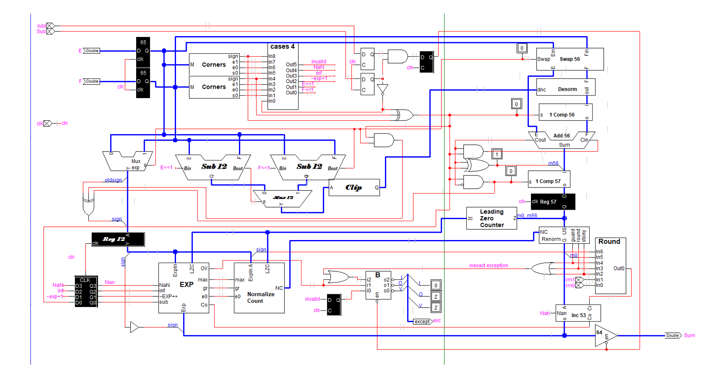
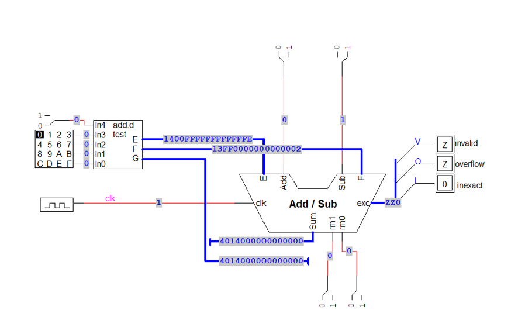

# IEEE-754 Double-Precision Floating Point Add/Sub Unit

## Overview

This project implements an IEEE-754 double-precision floating-point add/subtract unit using LogicWorks. The design supports floating-point addition and subtraction while handling exponent alignment, mantissa arithmetic, normalization, rounding, and exception generation.

Developed as part of CMPE421 (Computer Architecture II) at California State University, East Bay.

## Architecture Overview



The floating-point datapath consists of multiple functional blocks responsible for operand analysis, exponent comparison, operand alignment, arithmetic operations, normalization, rounding, and exception handling.

Major modules include:

* Corner Case Detection
* Exponent Comparison
* Operand Swapping
* Denormalization
* Mantissa Add/Subtract Logic
* Leading Zero Counter (LZC)
* Normalize Count Logic
* Exponent Adjustment
* Renormalization
* Rounding Logic
* Exception Handling

## Top-Level Interface



Top-level testbench used to validate floating-point addition and subtraction operations and verify exception generation.

## Features

* IEEE-754 double-precision floating-point arithmetic
* Addition and subtraction operations
* Exponent comparison and alignment
* Mantissa arithmetic datapath
* Operand swapping logic
* Leading Zero Counter (LZC)
* Normalization and renormalization
* Rounding support
* Invalid operation detection
* Overflow detection
* Inexact result detection

## Verification Methodology

The design was verified using multiple validation approaches:

### Corner Case Analysis

Verification spreadsheets were developed to evaluate:

* NaN propagation
* Positive and negative infinity operations
* Denormal number handling
* Zero handling
* Overflow conditions
* Underflow conditions

### Exponent and Normalization Verification

Additional validation was performed for:

* Exponent adjustment logic
* Leading Zero Counter behavior
* Normalize Count generation
* Renormalization operations
* Rounding-induced exponent updates

### Assembly-Based Testing

A dedicated assembly test suite was developed to verify:

* Infinity arithmetic
* NaN generation
* Precision-boundary behavior
* Denormal operations
* Overflow and underflow scenarios
* IEEE-754 edge cases

## Repository Structure

```text
circuit/
    LogicWorks implementation

images/
    Architecture and interface diagrams

presentation/
    Project presentation

verification/
    Corner-case and normalization verification

testing/
    Assembly-based validation test suite
```

## Technologies

* LogicWorks
* Digital Logic Design
* Computer Architecture
* IEEE-754 Floating Point Arithmetic
* Assembly Language
* Verification and Validation

## Team

* Inderpal Singh
* Sukhpinder Singh
* Pierreline Jacob
* Feranmi Falodun

## Course

CMPE421 – Computer Architecture II
California State University, East Bay
